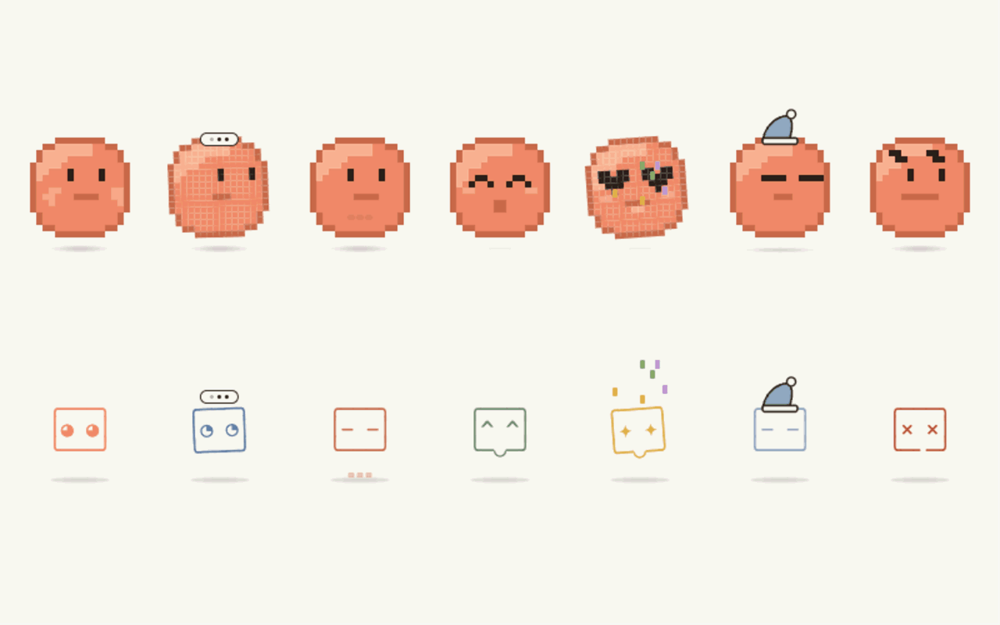

<div align="center">


# Agent Repo Shell

**Browse your agentic / Claude-Code repo as a navigable webview** — file tree, LSP-powered file overviews, in-content find, with two pixel pets for company.

[](https://marketplace.visualstudio.com/items?itemName=ChengyueWang.agent-repo-shell) · [](LICENSE) · [](https://github.com/ChengyueWang/agent-repo-shell)

</div>

<!--
  HERO GIF — drop in once recorded:
  
-->

> A workspace browser for AI-coding workflows. Built for the kind of repos that hold your specs, tasks, sessions, and helper scripts alongside code — gives you a one-pane view of the whole thing without endless folder clicking.

---

## ✨ Highlights

- 📂 **Sidebar file tree** — arbitrary-depth nesting, instant fuzzy filter (`/`), right-click favorites & hide
- 📄 **One-click open** — markdown renders inline; code files open in editor *and* render a structured overview in the panel
- 🧭 **LSP file overviews** — title + summary, Mermaid call-graph, function accordion with signatures and call trees, "used by" references, TODO/FIXME scan
- 🔎 **Find in content** — custom widget with match count and navigation (the native one is unreliable in webviews)
- 💬 **Session history** — `history/<id>/{prompts,responses}.md` rendered as chat-style transcripts
- 🐾 **Two pixel pets** — Pet03 (16×16 orb) and Pet04 (ASCII familiar), 7 moods, soft idle animations
- 🔄 **Auto-refresh** on file changes

---

## 🗂 Browse your repo

The sidebar mirrors your workspace tree but flattens the parts you don't care about. Press `/` anywhere in the panel to focus the filter — substring match against full paths, matches auto-expand their parent folders.

<!--  -->

Right-click any entry for **★ Favorites**, **Hide**, **Copy Path**, **Rename**, **Delete**. Favorited files surface in a top section with parent-dir hints (so two files named `ideas.md` in different folders are distinguishable at a glance). Hidden entries disappear from the tree; toggle "show N hidden" in the eyebrow to bring them back.

---

## 🔍 See any file at a glance

Click any code file in the sidebar — instead of just opening it in the editor, the panel renders a *structured overview*:

<!--  -->

- **Title + summary** from the leading docstring / comment
- **Mermaid call-graph** of intra-file functions (entry / mid / helper tiers, color-coded). Hover for one-line summary, click to jump to definition.
- **Function accordion** — one row per top-level callable. Expand for signature, doc, "calls" and "called by" trees, and a → jump link.
- **"Used by"** — workspace-wide references to this file's exports
- **TODO / FIXME** scan over the source

All sourced from VSCode's built-in LSP commands (`executeHoverProvider`, `executeDocumentSymbolProvider`, `prepareCallHierarchy`, `executeReferenceProvider`) — **no markers needed in your code, works on any language with an installed LSP**.

Overviews are cached as JSON sidecars in `.code-render/<path>.json`, so subsequent clicks render instantly. A **Sync** button re-runs analysis when you've changed the file.

---

## 🔎 Find anywhere

`Ctrl/Cmd+F` opens our own find widget (the native one is broken in webviews — confirmed via VSCode source review):

<!--  -->

- Live highlighting with match count (`1 of 12`)
- `Enter` / `Shift+Enter` to navigate; ↑↓ buttons; `Esc` to close
- Auto-opens collapsed `<details>` so matches inside accordions are still reachable
- Survives sidebar rebuilds (after favorite/hide toggles)
- Styled to match VSCode's editor find widget — picks up your theme automatically

---

## 🐾 Meet your pets

The panel ships with **two pixel companions** — both fully animated, with 7 moods and optional accessories. They live in the bottom-right corner, blink, breathe, and react to what you're doing.



- **Pet03** — 16×16 pixel orb. Coral palette. The default.
- **Pet04** — 3-line ASCII familiar in monospace. For the terminal aesthetic.

Moods: `idle` · `thinking` · `typing` · `success` · `celebrating` · `sleeping` · `error`. Accessories: `chef` · `beanie` · `headphones` · `antenna` · `party` · `sleep cap` · `bow`.

---

## ⌨️ Keyboard shortcuts (inside the panel)

| Key | Action |
|-----|--------|
| `/` | Focus the sidebar filter |
| `Ctrl/Cmd+F` | Open find-in-content |
| `Enter` / `Shift+Enter` | Next / previous match (in find) |
| `Esc` | Close find / clear filter |
| Right-click | Favorite / Hide / Copy Path / Rename / Delete |

---

## 📁 Conventions

Most paths are opinionated defaults useful for "agent repo" style workspaces, but the extension works on any repo:

| Path | Meaning |
|------|---------|
| `specs/`, `tasks/`, `skills/`, `references/`, `targets/` | Top-level folders shown as sidebar sections even when empty |
| `history/<id>/{prompts,responses}.md` | Session transcripts auto-grouped into a "history" section, rendered as chat |
| `tasks/{todo,doing,done}/<file>.md` | Task files get a state chip at the top-right; click to move between subfolders |
| `.code-render/<path>.json` | Sidecar cache for file overviews; safe to commit (portable across machines) |

---

## 📦 Install

```
Cmd/Ctrl+Shift+X → search "Agent Repo Shell" → Install
```

Or from the [Marketplace listing](https://marketplace.visualstudio.com/items?itemName=ChengyueWang.agent-repo-shell).

---

## 🚀 Usage

1. Open any folder in VSCode.
2. `Cmd/Ctrl+Shift+P` → **Agent Repo Shell: Open View**
3. Browse, filter, click. Right-click for context menu.

---

## 📜 License

MIT — see [LICENSE](LICENSE). Want to hack on this? See [DEVELOPMENT.md](https://github.com/ChengyueWang/agent-repo-shell/blob/main/DEVELOPMENT.md).

### Acknowledgements

- Markdown via [marked](https://github.com/markedjs/marked) + [highlight.js](https://github.com/highlightjs/highlight.js)
- Diagrams via [Mermaid](https://github.com/mermaid-js/mermaid)
- Anchored comments via [Recogito Text Annotator](https://github.com/recogito/text-annotator-js)
- Star icon adapted from [Heroicons](https://heroicons.com/) (MIT)
- Pet sprites are original pixel art
