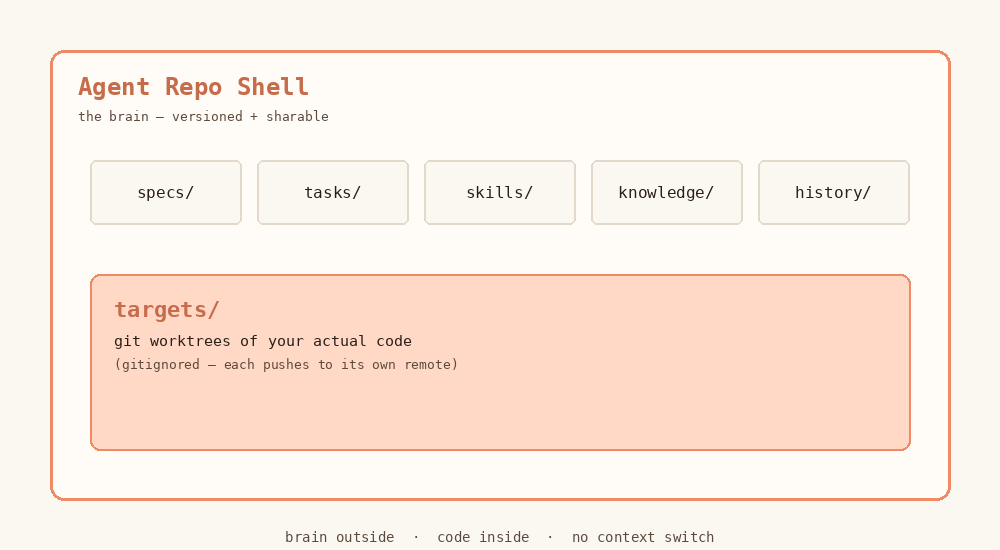
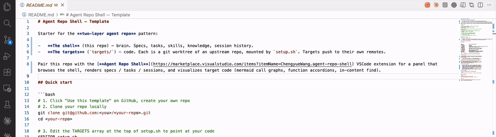
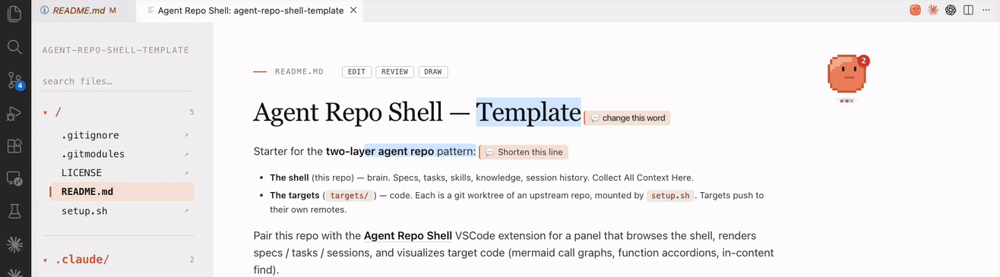
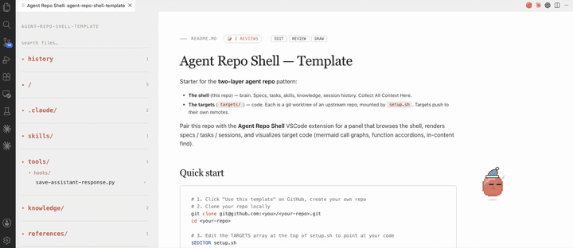
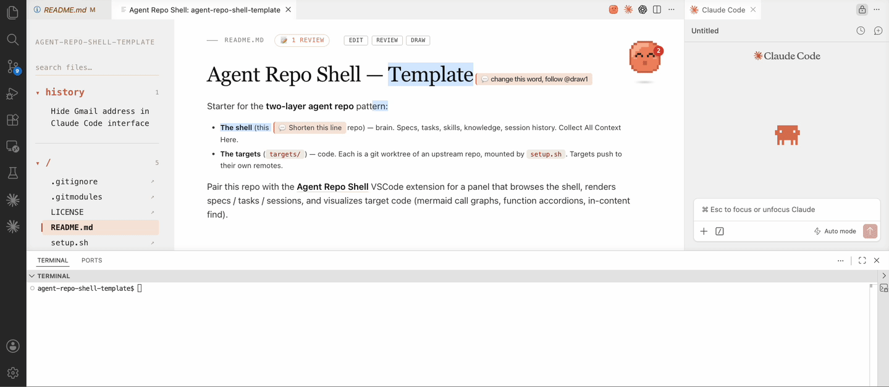
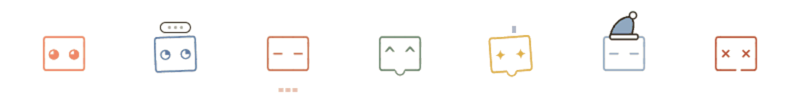

# Agent Repo Shell

A doc-centric workspace for agentic coding.

 · 

---

## 📦 Agent shell wraps your repo

Brain outside, code inside. No context switch.

## 📝 Markdown like Notion

Read AND edit inline. No mode toggle.

## 🎨 Sketch anywhere, AI sees it

Draw on docs → auto-snap for vision AI.

## 🔀 Code as flowchart

<!--  -->

Mermaid graph per file. Click to jump.

## 🤖 Any AI, just copy

<!--  -->

Output is markdown. Drop into Claude / Cursor / GPT.

## 🧠 ADHD-friendly Sidebar

<!--  -->

Favorites + hide. Keep mental space clear.

## 🐾 Meet Your Pets

---

## Get started

1. Clone the [template](https://github.com/ChengyueWang/agent-repo-shell-template) (click *Use this template* on GitHub). You get the directory layout, sample content, and Claude Code session capture pre-wired.
2. Install the extension — `Cmd/Ctrl+Shift+X` → search **Agent Repo Shell**.
3. Open the folder, run `Cmd/Ctrl+Shift+P` → **Agent Repo Shell: Open View**.

## License

MIT. [Dev docs](https://github.com/ChengyueWang/agent-repo-shell/blob/main/DEVELOPMENT.md)
